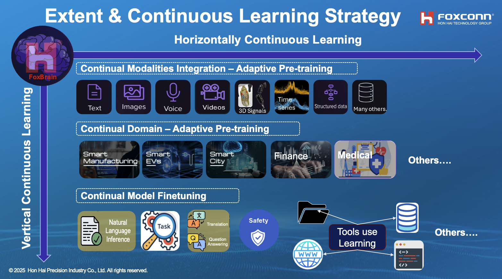

<h1 align="center">
  <span> FoxBrain - Advancing Foundation Model</span>
</h1>

<div align="center">
     
</div>


Discover how the FoxBrain team from Foxconn's Research Institute is building the next-generation AI foundation model. We'll share detailed insights 


## 🚀 Highlight: Join FoxBrain at NVIDIA GTC 2025!

Discover how FoxBrain is advancing the state-of-the-art in Foundation Models. Join us for an in-depth presentation:

[**"From Open Source to Frontier AI: Build, Customize, and Extend Foundation Models"**](https://www.nvidia.com/gtc/session-catalog/?search=foxconn&tab.catalogallsessionstab=16566177511100015Kus&search=foxconn#/session/1734052072050001Ux0A)
📅 **Date:** March 20, 2025


## 💡 Get help - [Q&A](https://github.com/TranNhiem/FoxBrain_LLMs/discussions) or [Discord 💬](https://discord.gg/z7epQGBR7q)
<!--
# News: 
+ [2023.08.27] We release BLOOMZ 3B, 7B instruction fine-tuning on 52k Traditional Chinese alpaca🔥
+ [2023.09.02] We release LLaMA2 7B, 13B (4k and 8K Context Length) fine-tuning on 200k Zh_Chinese and English pair Mix Instruction 🔥

+ [Comming_soon] We release Yi 6B, 34B fine-tuning on 200k Zh_Chinese and English pair Mix Instruction 🔥
-->

We will soon provide a number of model checkpoints that we trained. Please find them on Hugging Face [here](https://huggingface.co/FoxconnAI). 


| **Model**         |                   **Link**                                                            | 
|--------------------------------------------------------|-------------------------------------------------------------------------------------------------------------------------------|
| **FoxBrain v1.0  (LLama3.1 based)**  | 🤗 <a href="" target="_blank">Released Soon</a>  | 
<!--
| **FoxBrain v1.0 7B SFT (LLama2 based)**  | 🤗 <a href="" target="_blank">Zh_llama2_7B_8K_SFT_General_domain</a>  | 
| **FoxBrain v1.0 13 B SFT (LLama2 based)**  | 🤗 <a href="" target="_blank">Zh_LLama2_13B_4K_SFT_General_Domain_Knowledge</a>  | 
| **FoxBrain v1.0 7B SFT (LLama2 based)**  | 🤗 <a href="" target="_blank">Zh_llama2_7B_4K_SFT_General_domain</a>  | 
| **FoxBrain v1.0 SFT 3B (Bloomz Based)** | 🤗 <a href="" target="_blank">Zh_Bloomz_3B_SFT </a>  | 
| **FoxBrain v1.0 SFT 7B (Bloomz Based)** | 🤗 <a href="" target="_blank">Zh_Bloomz_7B_SFT </a>  | 

-->


# Demo: 

+ [**FoxBrain Battel Chat  Demo**](http://13.65.249.11:8886/)
+ [**FoxBrain SolutionCraft Demo**](http://13.65.249.11:8884/)


<div align="center">
     
</div>


## How can you help

Stay tuned and follow our progress or contribute directly on GitHub!

Reach out to the FoxBrain team member Rick at rick.tvn@foxconn.com.

```bibtex
@misc{FoxBrain,
    author={Tran Nhiem, HHRAI},
    title={FoxBrain Building, Extending \& Customizing Foundation Models},
    year={2023},
    url={https://github.com/TranNhiem/FoxBrain_LLMs}
}
```


