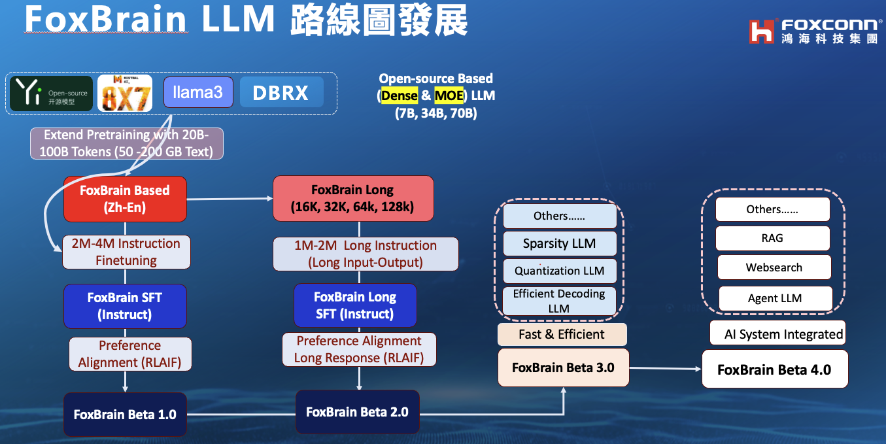

# FoxBrain_LLMs
項目內容包括：1.  創建多樣化、高質量的中文教學數據集。2. 在開源語言模型（如bloomz、LLaMA2、Yi, Qwen\等）上進行LLM訓練、微調、評估和測試。Building a diverse and high-quality Chinese instruction dataset. 2. LLM training, finetuning, evaluating, and testing on open-source language models


<h1 align="center">
  <span> FoxBrain - Advancing Language Models Community in Traditional Chinese Roadmap</span>
</h1>

<div align="center">
     
</div>


## 💡 Get help - [Q&A](https://github.com/TranNhiem/FoxBrain_LLMs/discussions) or [Discord 💬](https://discord.gg/z7epQGBR7q)

# News: 
+ [2023.08.27] We release BLOOMZ 3B, 7B instruction fine-tuning on 52k Traditional Chinese alpaca🔥
+ [2023.09.02] We release LLaMA2 7B, 13B (4k and 8K Context Length) fine-tuning on 200k Zh_Chinese and English pair Mix Instruction 🔥

+ [Comming_soon] We release Yi 6B, 34B fine-tuning on 200k Zh_Chinese and English pair Mix Instruction 🔥


We provide a number of model checkpoints that we trained. Please find them on Hugging Face [here](https://huggingface.co/trannhiem). Here are some quick links to the checkpoints that are finetuned from LLaMa 2:

| **Model**         |                   **Link**                                                            | 
|--------------------------------------------------------|-------------------------------------------------------------------------------------------------------------------------------|
| **FoxBrain v1.0 13B SFT (LLama2 based)**  | 🤗 <a href="" target="_blank">Zh_LLama2_13B_8K_SFT_General_Domain_Knowledge</a>  | 
| **FoxBrain v1.0 7B SFT (LLama2 based)**  | 🤗 <a href="" target="_blank">Zh_llama2_7B_8K_SFT_General_domain</a>  | 
| **FoxBrain v1.0 13 B SFT (LLama2 based)**  | 🤗 <a href="" target="_blank">Zh_LLama2_13B_4K_SFT_General_Domain_Knowledge</a>  | 
| **FoxBrain v1.0 7B SFT (LLama2 based)**  | 🤗 <a href="" target="_blank">Zh_llama2_7B_4K_SFT_General_domain</a>  | 
| **FoxBrain v1.0 SFT 3B (Bloomz Based)** | 🤗 <a href="" target="_blank">Zh_Bloomz_3B_SFT </a>  | 
| **FoxBrain v1.0 SFT 7B (Bloomz Based)** | 🤗 <a href="" target="_blank">Zh_Bloomz_7B_SFT </a>  | 

## Data

Here are some quick links to the datasets that we used to train the models:
| **Dataset**                      | **Link**                                                                                                                        | **Note**                    |
|----------------------------------|-----------------------------------------------------------------------------------------------------------------------------------|------------------------------|
| **Mix Instruction-tuning**  |  [ Zh Mix Instructions]()                                                                         |                              |
| **Traditional Chinese 52K Alpaca**        | [Zh Alpaca 52k]() | Translated using GPT-3.5    |
| **Traditional Chinese Lima 1K**           | [Zh Lima 1K]()  | Translated by GPT-4         |
| **Zh_Dolly**             | [Traditional Chinese Dolly]()                                                                                  | Translated by GPT-4         |


# Demo: 

+ [**FoxBrain 13B (Based LLama2 Model) Demo**]()
+ [**FoxBrain 7B (Based LLama2 Model) Demo**]()


<div align="center">
     
</div>


# Table of Contents

- [Project Introduction](#Project-Introduction)
- [Project Goal](#Project-Goals)
- [Project Structure](#Project-Structure)
- [Project Plan](#Project-Plan)
- [How Can You help](#How-can-you-help)

## Project Introduction:

Hello and welcome to the FoxBrain project! This project aims to create Traditional instruction datasets and perform Supervised instruction fine-tuning, as well as Human Preference alignment on various open-source language models such as BloomZ, LLaMa 2, Yi, Qwen, and many others.

## Project Goals:

- Build a high-quality Traditional Chinese Instruction Dataset
- Train, Fine-tune, and Evaluate Multilingual Language Models with a special focus on (Traditional Chinese and English) (Training, Finetuning, Evaluation)
- Design an Application with an optimized User Interface for performance

## Project Structure

Below is the project structure, outlining key sections and their primary functions:

### 1. Benchmark

### 2. Finetune LLM Model

### 3. Efficient LLM Model

### 4. WebApp


## Project plan

[D Slide Structure]() 

### Step 1: Leverage Available Public high quality instruction dataset
- Available high quality English based instructions dataset : [Alpaca](https://github.com/tatsu-lab/stanford_alpaca/blob/main/alpaca_data.json), [Dolly 15k](https://huggingface.co/datasets/databricks/databricks-dolly-15k), [OpenAssistant](https://huggingface.co/datasets/OpenAssistant/oasst1), [Filtered_ShareGPT](https://huggingface.co/datasets/anon8231489123/ShareGPT_Vicuna_unfiltered) others dataset.

-  Build a system, display statistics showing different topics in the collected dataset. The purpose is to remove data containing misleading, harmful, spam, junk, or personal information or data that does not meet requirements.

### Step 2: Create Automatic Instruction Datasets

- Use OpenAI GPT-3.5, GPT-4 to generate instruction datasets.
- Objective: Collect 500,000 to 1 million samples of input instructions + feedback (Instructions, outputs)
- Simultaneously, we collect instructions generated by humans available in Traditional Chinese and English.

- Translation Dataset

  - `Using_OpenAI_Translate_API`: Use OpenAI GPT-3.5 and GPT-4 to translate datasets. This is a method for achieving good results.

- Synthetic Generate Instruction Dataset 

  - `Alpaca_instruction_OpenAI_api`: Use the Stanford Alpaca template to create instruction datasets. Initially, via 175 tasks, human-generated instructions.

  - `Evolutionary_instruction_OpenAI_api` Using Evolutional algorithm to Generate Instruction Dataset 


### Step 3 :Supervised instruction Finetuning
- Based on the Traditional Chinese instruction dataset, carry out the SFT phase to fine-tune the model.

- Fine-tuning Section based on Open-Source Based LLMs (BLOOMZ, LLaMA2, Yi, etc.)

  - `Full Finetune_llm`: Fine-tune all layers of language models (LLMs) based on open-source code such as LLaMa 2, Open-LLaMA, etc.

  - `Finetune_llm_QLoRA_&_unsloth Technique`: Efficiently fine-tune language models (LLMs) based on open-source code.

### Step 4: Continue Training the Model with Human Preference RLHF (Reinforcement Learning from Human Feedback) and DPO (Direct Policy Optimization) Phases

After completing Step 3, we can proceed with training the model in the RLHF phase based on human instruction data from the publicly available OpenAssistant project.
Remember that these steps represent a general process and can be adjusted and supplemented according to the specific requirements of the project."

## How can you help

+ Would you like to contribute to the project? Please refer to the Contribute_guideline for instructions on how to get started and collaborate on this project together.

```
@misc{FoxBrainLLM,
    author={HHRAI},
    title={FoxBrain Large-Scale Finetuning of Language Models on Traditional Chinese},
    year={2023},
    url={https://github.com/TranNhiem/FoxBrain_LLMs},
}
```


