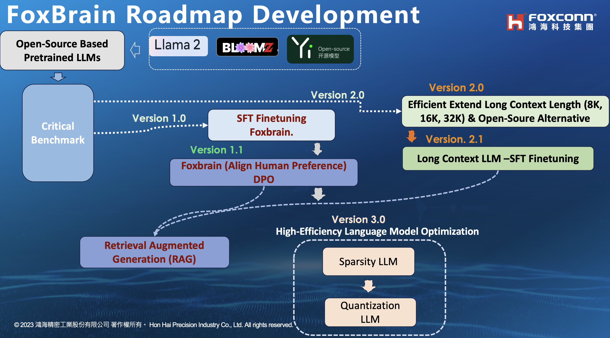

# FoxBrain_LLMs
項目內容包括：1.  創建多樣化、高質量的中文教學數據集。2. 在開源語言模型（如bloomz、LLaMA2、Yi, Qwen\等）上進行LLM訓練、微調、評估和測試。Building a diverse and high-quality Chinese instruction dataset. 2. LLM training, finetuning, evaluating, and testing on open-source language models


<h1 align="center">
  <span> FoxBrain - Advancing Language Models Community in Traditional Chinese Roadmap</span>
</h1>

<div align="center">
     
</div>


## 💡 Get help - [Q&A](https://github.com/TranNhiem/FoxBrain_LLMs/discussions) or [Discord 💬](https://discord.gg/z7epQGBR7q)

# News: 
+ [2023.08.27] We release BLOOMZ 3B, 7B instruction fine-tuning on 52k Traditional Chinese alpaca🔥
+ [2023.09.02] We release LLaMA2 7B, 13B (4k and 8K Context Length) fine-tuning on 200k Zh_Chinese and English pair Mix Instruction 🔥

+ [Comming_soon] We release Yi 6B, 34B fine-tuning on 200k Zh_Chinese and English pair Mix Instruction 🔥


We provide a number of model checkpoints that we trained. Please find them on Hugging Face [here](https://huggingface.co/trannhiem). Here are some quick links to the checkpoints that are finetuned from LLaMa 2:

| **Model**         |                   **Link**                                                            | 
|--------------------------------------------------------|-------------------------------------------------------------------------------------------------------------------------------|
| **FoxBrain v1.0 13B SFT (LLama2 based)**  | 🤗 <a href="" target="_blank">Zh_LLama2_13B_8K_SFT_General_Domain_Knowledge</a>  | 
| **FoxBrain v1.0 7B SFT (LLama2 based)**  | 🤗 <a href="" target="_blank">Zh_llama2_7B_8K_SFT_General_domain</a>  | 

| **FoxBrain v1.0 13 B SFT (LLama2 based)**  | 🤗 <a href="" target="_blank">Zh_LLama2_13B_4K_SFT_General_Domain_Knowledge</a>  | 
| **FoxBrain v1.0 7B SFT (LLama2 based)**  | 🤗 <a href="" target="_blank">Zh_llama2_7B_4K_SFT_General_domain</a>  | 


| **FoxBrain v1.0 SFT 3B (Bloomz Based)** | 🤗 <a href="" target="_blank">Zh_Bloomz_3B_SFT </a>  | 
| **FoxBrain v1.0 SFT 7B (Bloomz Based)** | 🤗 <a href="" target="_blank">Zh_Bloomz_7B_SFT </a>  | 
## Data

Here are some quick links to the datasets that we used to train the models:
| **Dataset**                      | **Link**                                                                                                                        | **Note**                    |
|----------------------------------|-----------------------------------------------------------------------------------------------------------------------------------|------------------------------|
| **Mix Instruction-tuning**  |  [ Zh Mix Instructions]()                                                                         |                              |
| **Traditional Chinese 52K Alpaca**        | [Zh Alpaca 52k]() | Translated using GPT-3.5    |
| **Traditional Chinese Lima 1K**           | [Zh Lima 1K]()  | Translated by GPT-4         |
| **Zh_Dolly**             | [Traditional Chinese Dolly]()                                                                                  | Translated by GPT-4         |
| **Traditional Chinese Instruction of How**             | [Zh Instruction How Step by Step]()                                                                                  | Extracted from Vietnamese WikiHow       |


# Demo: 

+ [**FoxBrain 13B (Based LLama2 Model) Demo**]()
+ [**FoxBrain 7B (Based LLama2 Model) Demo**]()


<div align="center">
     
</div>


# Table of Contents

- [Project Introduction](#Project-Introduction)
- [Project Goal](#Project-Goals)
- [Project Structure](#Project-Structure)
- [Project Plan](#Project-Plan)
- [How Can You help](#How-can-you-help)

## Project Introduction:

Hello and welcome to the FoxBrain project! This project aims to create Traditional instruction datasets and perform Supervised instruction fine-tuning, as well as Human Preference alignment on various open-source language models such as BloomZ, LLaMa 2, Yi, Qwen, and many others.

## Project Goals:

- Build a high-quality Traditional Chinese Instruction Dataset
- Train, Fine-tune, and Evaluate Multilingual Language Models with a special focus on (Traditional Chinese and English) (Training, Finetuning, Evaluation)
- Design an Application with an optimized User Interface for performance

## Project Structure

Dưới đây là cấu trúc của dự án, mô tả các phần quan trọng và chức năng chính của chúng:

### benchmark

### 2. Training & Fine-tune LLM Model

<!-- ### 3. Giao Diện Web (Web UI Interface)

Thư mục `/WebUI` chứa các tệp tin và công cụ liên quan đến giao diện người dùng qua Web.

- Hiện tại, để nhanh chóng và thuận tiện cho việc demo và kiểm thử, chúng tôi sử dụng Gradio để phát triển giao diện.

  - `assistant_gradio.py`: Đây là ứng dụng đã được phát triển dựa trên Gradio, cho phép trải nghiệm trực quan và trò chuyện với trợ lý thông qua giao diện Web.

Hy vọng Với cấu trúc này, dự án có thể được quản lý một cách cụ thể và dễ đàng để cập nhập [mọi người có thể góp ý để có một cấu trúc tốt hơn]() -->


## Project plan

[Project Slide Structure]() 

### Bước 1: Dịch tập dữ liệu hướng dẫn
- Mục tiêu: Dịch các bộ dữ liệu chuẩn và chất Lượng English based instructions dataset : [Alpaca](https://github.com/tatsu-lab/stanford_alpaca/blob/main/alpaca_data.json), [Dolly 15k](https://huggingface.co/datasets/databricks/databricks-dolly-15k), [OpenAssistant](https://huggingface.co/datasets/OpenAssistant/oasst1), [Filtered_ShareGPT](https://huggingface.co/datasets/anon8231489123/ShareGPT_Vicuna_unfiltered) others dataset.
- Xây dựng hệ thống, thống kê hiển thị các chủ đề khác nhau trong tập dữ liệu đã thu thập. Mục đích là loại bỏ dữ liệu chứa thông tin gây lặn, độc hại, spam, rác rưởi hoặc thông tin cá nhân hoặc các dữ không đạt yêu cầu.

### Bước 2: Tạo tập dữ liệu hướng dẫn tự động
- Sử dụng OpenAI GPT-3.5, GPT-4 để tạo tập dữ liệu hướng dẫn.
- Mục tiêu: Thu thập 500.000 đến 1 triệu mẫu hướng dẫn đầu vào + phản hồi (Instructions, outputs)
- Đồng thời, chúng tôi thu thập các hướng dẫn được tạo bởi con người có sẵn bằng tiếng Việt.


Thư mục `/Generate_and_Translate_Dataset` chứa các bộ dữ liệu và công cụ liên quan đến việc tạo và dịch các instruction dataset.

- Phần Dịch (Translation Dataset)

  - `Using_OpenAI_Translate_API.py`: Sử dụng OpenAI GPT-3.5 và GPT-4 để dịch các bộ dữ liệu. Đây là một phương pháp cho kết quả tốt.

  - `Using_NLLB_MetaAI_Translate.py`: Sử dụng NLLB làm mô hình cho việc dịch. Bạn có thể sử dụng 54B model để đạt được kết quả tương đối.

- Phần Tạo Instruction Dataset 

  - Chi tiết kỹ thuật dùng [tạo Instruction dataset]() 

  - `Generation_instruction_OpenAI_api.py`: Sử dụng Stanford Alpaca template để tạo các instruction dataset. Gồm hơn 175 instruction tasks được tạo bởi con người.

  - Using Evolutional algorithm to Generate Instruction Dataset [evol_instruct_generate]()


### Bước 3: Kiểm định và tiền xử lý tập dữ liệu
- Kết hợp tập dữ liệu từ Bước 1 và Bước 2.
- Tiền xử lý tập dữ liệu để chuẩn bị cho các bước tiếp theo.

### Bước 4: Tiến hành giai đoạn SFT (Supervised instruction Finetuning)
- Dựa trên tập dữ liệu hướng dẫn tiếng Việt, tiến hành giai đoạn SFT để tinh chỉnh mô hình.


Thư mục `/LLMs` chứa các tệp tin và công cụ để training và fine-tune các mô hình ngôn ngữ (Language Models).

- Phần Fine-tuning dựa trên các Open-Source Based LLMs (BLOOMZ, Open-LLaMA, v.v.)

  - `Full Finetune_llm`: fine-tune all layers các mô hình LLMs dựa trên các mã nguồn mở như BLOOMZ, Open-LLaMA, v.v.

  - `Finetune_llm_QLoRA.py`: Efficient fine-tune các mô hình LLMs dựa trên các mã nguồn mở.

### Bước 5: Tiếp tục huấn luyện mô hình với giai đoạn Human Preference RLHF (Reinforcement Learning from Human Feedback) and DPO (Direct Policy Optimization)
- Sau khi hoàn thành Bước 4, chúng ta có thể tiếp tục huấn luyện mô hình với giai đoạn RLHF dựa trên tập dữ liệu hướng dẫn từ con người thuộc dự án OpenAssistant công khai.

Hãy nhớ rằng các bước này đại diện cho quy trình chung và có thể được điều chỉnh và bổ sung theo yêu cầu cụ thể của dự án.

## How can you help

+ Would you like to contribute to the project? Please refer to the Contribute_guideline for instructions on how to get started and collaborate on this project together.

```
@misc{vietnameseLLM,
    author={HHRAI},
    title={FoxBrain Instruction Data Corpus for Large-Scale Finetuning of Language Models},
    year={2023},
    url={https://github.com/TranNhiem/FoxBrain_LLMs},
}
```


